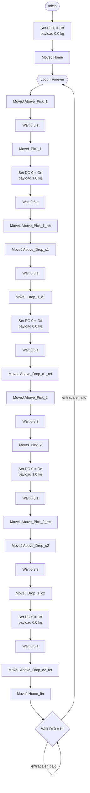

# Diagrama de flujo — Pick and Place UR5

Cada caja corresponde a un nodo del árbol de PolyScope.

```mermaid
flowchart TD
    A([Inicio]) --> B[Set DO 0 = Off<br/>payload 0.0 kg]
    B --> C[MoveJ Home]
    C --> D{{Loop · Forever}}

    D --> E[MoveJ Above_Pick_1]
    E --> F[Wait 0.3 s]
    F --> G[MoveL Pick_1]
    G --> H[Set DO 0 = On<br/>payload 1.0 kg]
    H --> I[Wait 0.5 s]
    I --> J[MoveL Above_Pick_1_ret]
    J --> K[MoveJ Above_Drop_c1]
    K --> L[Wait 0.3 s]
    L --> M[MoveL Drop_1_c1]
    M --> N[Set DO 0 = Off<br/>payload 0.0 kg]
    N --> O[Wait 0.5 s]
    O --> P[MoveL Above_Drop_c1_ret]

    P --> Q[MoveJ Above_Pick_2]
    Q --> R[Wait 0.3 s]
    R --> S[MoveL Pick_2]
    S --> T[Set DO 0 = On<br/>payload 1.0 kg]
    T --> U[Wait 0.5 s]
    U --> V[MoveL Above_Pick_2_ret]
    V --> W[MoveJ Above_Drop_c2]
    W --> X[Wait 0.3 s]
    X --> Y[MoveL Drop_1_c2]
    Y --> Z[Set DO 0 = Off<br/>payload 0.0 kg]
    Z --> AA[Wait 0.5 s]
    AA --> AB[MoveL Above_Drop_c2_ret]

    AB --> AC[MoveJ Home_fin]
    AC --> AD{Wait DI 0 = HI}
    AD -- entrada en bajo --> AD
    AD -- entrada en alto --> D
```
